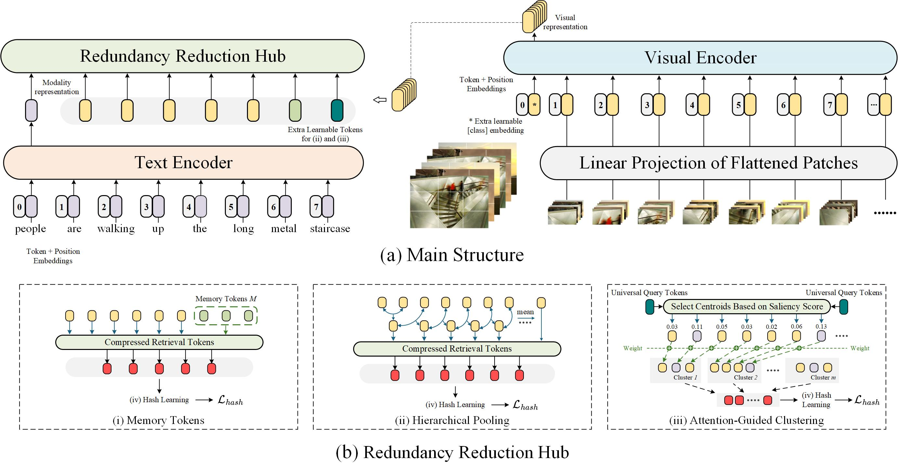

# RACH: Redundancy-Aware Cross-Modal Hashing

## ICIG 2026
```
- Memory_Tokens_Hierarchical_Pooling.py  记忆和池化
- metrics.py 性能指标文件
- train.py 训练文件
- dataset 数据集 (25k,nus,coco)
- model CLIP
```

## Main framework

